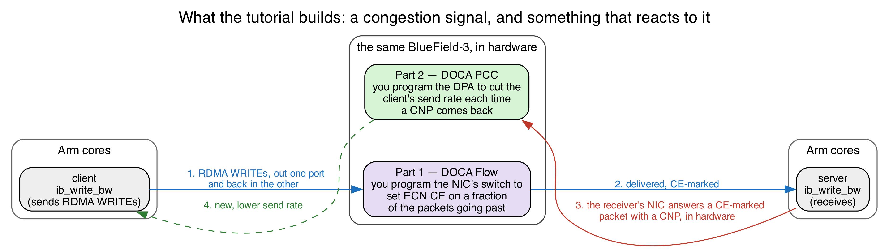
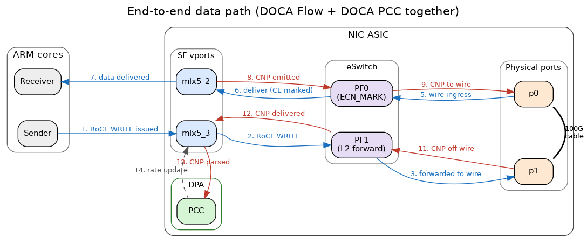

<!--
  ================================================================================================
  FOURTH DRAFT. Notes for us, not for participants. Last worked on: 2026-08-16.
  ================================================================================================

  Written against a 30-MINUTE hands-on budget, with everything conceptual demoted to appendices
  that say plainly they can be skipped. Measured 2026-08-16: 3,900 words on the critical path
  (intro through "What you built"), 5,850 with the appendices; 14 pages, of which the appendices
  are the last five. Roughly the same as the draft before this rewrite -- the three-exercise Part D
  costs more words than the old TODO list, and dropping the capture path pays for it. Re-measure if
  you edit, and do not let the body grow: 3,900 words is already ~20 minutes of reading.

  WHAT PART D ACTUALLY IS, AND WHY THE FILES ARE SHAPED THIS WAY

  Three exercises, one function each: D.1 the root pipe, D.2 the marking pipe, D.3 the sampler.
  Every one of them ends in something visible -- line rate, then a climbing counter, then a split
  counter -- so nobody spends the session staring at a program that does nothing.

  The template SHIPS AS A WORKING FORWARDER. build_pipeline() calls create_root_pipe_nop(), a
  complete root pipe given to them, and everything else is commented out. So the first thing a
  participant does is run a program that works, and the "your program owns the eSwitch" lesson
  lands by taking that away rather than by starting from a dead link.

  create_root_pipe_nop() is deliberately 90% of the answer to D.1: the two differ only in the wire
  entry's forward, FWD_PORT vs FWD_PIPE. That is the point -- "the only difference between a
  forwarder and a pipeline is where the root sends wire traffic" -- and it makes the first exercise
  one nobody can fail in a timed session.

  THERE IS NO CAPTURE PATH IN THE EXERCISE. Three programs per tree now:

    doca_flow_ecn_pcap.c   marking + a hardware copy to a pcap (2.x mirror / 3.x flooding pipe).
                           Hand-maintained, ours, ships to the participants' -solutions/ only, and
                           is what D.2's optional sidebar points at for seeing the CE bit for real.
    doca_flow_solution.c   the same without any of that. THE answer key, and the source
                           regen_templates.py derives from.
    doca_flow_template.c   generated. Do not hand-edit.

  Dropping the mirror is what makes create_forward_to_sf_pipe identical on 2.x and 3.x: with it,
  the 3.x hit forward is a nine-line FWD_HASH_PIPE branch and the 2.x one is a single line.

  In the participant repo BOTH the template and the solution are called doca_flow_ecn.c, in
  doca-N/ and doca-N-solutions/ respectively -- sync_participants.py renames them. Every command in
  this guide runs from the top of the repository; keep it that way (`ninja -C doca-2/build`, not
  `cd doca-2 && ninja -C build`), because ./scripts/ does not exist one level down.

  FORM CHOICES, kept on purpose:
    PYTHON PSEUDO-CODE for main(), because the reader is navigating, not typing.
    A REAL C BLOCK for build_pipeline(), because they edit exactly that text.
    A TABLE for the six pipeline functions, marking given vs TODO.
    AN ENUMERATED LIST for the five-part pipe shape (end of Part B) -- deliberately not a code
    block: the logical components are the API calls, and the structs are merely their arguments.

  DO NOT use <details>/<summary> here, however well they read in tutorial-doca-flow.md: pandoc's
  LaTeX writer DROPS raw HTML silently, so those blocks would vanish from the PDF with no warning.
  Blockquotes are the portable substitute, and are what the callouts use.

  The guides Makefile warns if xelatex drops a glyph (Inconsolata has no box-drawing, arrows or
  superscripts). Keep diagrams as real figures, not ASCII art. `make -C guides check` also catches
  overfull lines, which pandoc never reports.

  STILL OPEN -- all of it needs a card

  0. NOTHING HERE HAS BEEN COMPILED. doca_flow_solution.c is new code in both trees and
     doca_flow_template.c is generated from it; neither has seen a DOCA header. Build both before
     the session.
  1. Every counter line quoted in Part D is written in the shape the code produces, not pasted
     from a real run. Replace with real pastes.
  2. The five `defined but not used` warnings D.1 promises are reasoned from -Wall semantics, not
     observed. meson's default warning_level=1 gives -Wall; the exercise target adds
     -Wno-unused-variable (see doca-flow/meson.build) so the ~20 unused-variable warnings from the
     scaffolded structs stay out of the way. Confirm the count.
  3. benchmark.sh resolves ttyplot as $SCRIPT_DIR/ttyplot/ttyplot; in the participant repo the
     script lands in scripts/, so it looks for scripts/ttyplot/ttyplot. Part A tells participants to
     use benchmark.sh first, so confirm setup_ttyplot.sh puts it where the synced copy will look.
  4. Unverified prose: the claim that participants never run setup_roce_loopback.sh themselves.
  5. THE HOST/DOCA TABLE at the top is transcribed from admin/results/*.print_doca_version.log --
     the last fleet-wide run of print_doca_version.sh, which reported pkg-config as the source on
     all twelve. Re-run `admin/fleet.py` and re-transcribe if a card is reimaged or added; the
     hostnames themselves match admin/machines.txt and the `tailscale status` listing in
     guides/tailscale.md, so those three have to be changed together.
     Note the password is printed in this PDF, matching what guides/tailscale.md already does.
  6. Nobody has walked the exercise using this guide, and nobody has timed it. The 30-minute claim
     is a design target, not a measurement. Time it on one card before the session.
  7. tutorial-doca-flow.md (the colleague's draft) still describes the OLD exercise -- four TODOs,
     mirroring, --pcap, Stage 1/Stage 2 -- and sync_participants.py still ships it. Left alone on
     purpose; retire or rewrite it before the session.
-->

In this part you program the **data plane** of a BlueField-3: you tell the NIC what to do with
packets *in its own hardware, at line rate*, before any CPU sees them. You will complete a program
that marks live RoCE traffic with an ECN congestion signal — the signal the congestion controller you
write in Part 2 reacts to.

# The cards, and how to reach them

Twelve BlueField-3 cards are available, in racks at four universities and NVIDIA. They are not on
the public internet: you reach them over the tutorial's Tailscale network, which you joined with the
pre-tutorial guide. If `tailscale status` lists the hosts below, you are ready.

**The cards do not all run the same DOCA release, and that decides which directory you work in for
the rest of this guide.** Find yours:

| Host                | DOCA | You work in |
| ------------------- | ---- | ----------- |
| `bf3-nvidia-1`      | 2.7  | `doca-2/`   |
| `bf3-nvidia-2`      | 2.7  | `doca-2/`   |
| `bf3-nvidia-3`      | 2.7  | `doca-2/`   |
| `bf3-nvidia-4`      | 2.7  | `doca-2/`   |
| `bf3-ulisbon-1`     | 2.9  | `doca-2/`   |
| `bf3-ulisbon-2`     | 2.9  | `doca-2/`   |
| `bf3-ulisbon-3`     | 2.9  | `doca-2/`   |
| `bf3-umich-1`       | 2.9  | `doca-2/`   |
| `bf3-umich-2`       | 2.9  | `doca-2/`   |
| `bf3-uwashington-1` | 3.1  | `doca-3/`   |
| `bf3-uwashington-2` | 3.1  | `doca-3/`   |
| `bf3-uwaterloo-1`   | 3.4  | `doca-3/`   |

Every command in this guide is written for `doca-2`; substitute `doca-3` throughout if that is your
release. The few places the two genuinely differ are marked **[2.x]** and **[3.x]**, and everything
unmarked applies to both.

Every card takes the same shared account, and `ssh` by hostname works once you are on the tailnet:

| **User** | **Password**        |
| -------- | ------------------- |
| `s26t`   | `sigcomm26tutorial` |

```bash
$ ssh s26t@bf3-ulisbon-1
```

> **Prerequisites.** That `ssh` puts you on the **Arm cores** of the BlueField-3 — a normal Ubuntu
> shell that happens to run inside the NIC. You have this repository in your home directory and can
> run `sudo`. **Every command below is typed on the Arm cores**; the host the card is plugged into
> is never involved.

# Part A — The card, and getting traffic onto it

Your card has **two ports connected to each other (p0 and p1)**, so whatever leaves `p1` arrives at `p0`. That
makes a single card behave like a small two-node network talking to itself. The two endpoints are
lightweight virtual NICs called **SFs** (sub-functions), one per port, each in its own network
namespace so the kernel cannot short-circuit them locally:

| Endpoint     | RDMA device | Namespace | IP         | Role                  |
| ------------ | ----------- | --------- | ---------- | --------------------- |
| SF on port 0 | `mlx5_2`    | `ns0`     | `10.0.0.1` | **server** (receives) |
| SF on port 1 | `mlx5_3`    | `ns1`     | `10.0.0.2` | **client** (sends)    |

The client sends RDMA WRITEs to the server. They leave `p1`, cross the cable, and arrive at
`p0` — where **your program** sees them.

What you are reproducing is an everyday situation in a datacenter network: a sender is going as fast
as it can, the network becomes congested, a switch on the path signals that congestion by setting
the **ECN** bits in the IP header, and the sender slows down. Here, **your card plays the congested
switch** — no congestion actually exists, you are *manufacturing* the signal, which is what makes it
easy to see and to dial up and down.

That splits into the two halves of the tutorial:

- **Part 1, this guide.** Program the NIC to set the ECN "congestion experienced" (CE) mark on a
  fraction of the packets going past — you choose the fraction. Everything happens in hardware;
  your program only installs the rules, then sits idle printing counters.
- **Part 2.** Program the DPA to *react*: the server's NIC answers a CE-marked packet with a
  congestion notification, and your algorithm turns each one into a lower send rate for the client.



**Where things are.** The repository has one directory per DOCA release, plus a matching
`-solutions` directory holding the finished program:

```
doca-2/doca-flow/doca_flow_ecn.c              <- the file you edit
doca-2-solutions/doca-flow/doca_flow_ecn.c    <- the finished version
scripts/                                      <- traffic generators
```

Every command in this guide is run from the top of the repository, so nothing below needs a `cd`.

**The network devices you will use.** Run this to see the card's network interfaces:

```bash
$ ip -br link show | grep -E '^p0|^p1|^enp3'
p0            UP    ...     # physical port 0
p1            UP    ...     # physical port 1
enp3s0f0s0    UP    ...     # a "sub-function" (SF) on the p0 side
enp3s0f1s0    UP    ...     # a "sub-function" (SF) on the p1 side
```

> **INFO — what is a sub-function?** A **sub-function (SF)** is a lightweight virtual NIC carved out
> of a physical port. It shows up as its own network device. We create one SF on each side and use
> the two of them as the *endpoints* of a network flow — so a single card can play both "sender" and
> "receiver" across the cable.

The traffic we will watch is **RoCE** (RDMA over Converged Ethernet), the high-speed, kernel-bypass
transport used in AI and storage networks. RoCE does not use normal sockets; programs reach it
through **RDMA devices** named `mlx5_0`, `mlx5_1`, `mlx5_2`, `mlx5_3`. List them:

```bash
$ rdma link show
link mlx5_0/1 ... netdev pf0hpf     # RDMA device for physical port p0
link mlx5_1/1 ... netdev p1         # RDMA device for physical port p1
link mlx5_2/1 ... netdev enp3s0f0s0 # RDMA device for the SF on p0 ← we use this one
link mlx5_3/1 ... netdev enp3s0f1s0 # RDMA device for the SF on p1 ← and this one
```

Remember this mapping: **`mlx5_2` and `mlx5_3` are the two SF endpoints** we send RoCE between.
`mlx5_0`/`mlx5_1` are the physical ports themselves.

**Step 1: wire up the two endpoints**.
The two ports are wired into a loopback and split into two isolated network sandboxes (Linux
network namespaces) called `ns0` and `ns1` — one SF in each, each with its own IP address
(`mlx5_2` → `ns0` → `10.0.0.1`, `mlx5_3` → `ns1` → `10.0.0.2`). This is already set up for you on
the tutorial card, so there's nothing to run here.

> **INFO — what is a network namespace?** It is a private, isolated network stack inside one Linux
> machine — its own interfaces, IPs, and routes. Putting each SF in its own namespace (`ns0`, `ns1`)
> is what makes them behave like two separate hosts even though they live on the same card. You run a
> command "inside" a namespace with `ip netns exec <name> <command>`.

**Step 2: put real traffic on the loopback.**
We generate traffic with `ib_write_bw` — a standard RoCE benchmarking tool (from the `perftest`
package) that measures how fast one endpoint can write data to another. It needs a server
(receiver) and a client (sender).

**Try it yourself! Send RoCE across the cable and measure it!**

Open **two terminals**, both on the Arm cores.

**Terminal 1 — the receiver (server).** Start this one first; it waits for a client:
```bash
sudo ip netns exec ns0 ib_write_bw -d mlx5_2 -R -x 1 -F --report_gbits
```
What the flags mean: `ip netns exec ns0` runs it inside the `ns0` sandbox; `-d mlx5_2` uses that
namespace's RDMA device; `-R` sets the connection up via the RDMA connection manager (keep this on —
Part II needs it); `-x 1` picks the RoCEv2 address; `-F` ignores a CPU-frequency warning;
`--report_gbits` prints the result in gigabits/second. It prints its settings and then says it is
**waiting for a client**.

**Terminal 2 — the sender (client).** Point it at the server's IP, `10.0.0.1`:
```bash
sudo ip netns exec ns1 ib_write_bw -d mlx5_3 -R -x 1 -F 10.0.0.1 --report_gbits
```

**You should see** a results table appear on both terminals, with the throughput climbing toward the
card's line rate:
```
 #bytes     #iterations   BW peak[Gb/sec]   BW average[Gb/sec]   MsgRate[Mpps]
 65536      529037          0.00              92.46                0.176344
```
That ~92 Gb/s is your proof the whole path works end to end: sender → `p1` → cable → `p0` → the
eSwitch → receiver. If you see a table with a real number, Part A is done.

> To avoid retyping the flags, the repo wraps these as scripts: `./scripts/run_server.sh` and
> `./scripts/run_client.sh` (one per terminal), or **`./scripts/benchmark.sh`**, which starts both
> ends together in a single command and streams the sender's throughput (Ctrl-C stops both). We use
> `benchmark.sh` from Part C on.

# Part B — DOCA Flow in one page

DOCA Flow is how you program that switch from C. Your program builds a small graph of **pipes**, and
each pipe answers four questions:

| Part        | The question it answers                | Example                                |
| ----------- | -------------------------------------- | -------------------------------------- |
| **match**   | *which* packets does this pipe act on? | "all IPv4 packets"                     |
| **monitor** | *how many* packets hit it?             | a hardware counter you can read        |
| **actions** | *what* do we change in the packet?     | rewrite a header field, or nothing     |
| **forward** | *where* does the packet go next?       | another pipe, a port, the CPU, or drop |

You describe these rules once, at startup. The NIC then applies them to every packet in hardware,
while your program sits idle printing counters. That is the whole idea: **match, count, modify,
forward.**

, "Architecture".](images/nvidia-doca-flow-pipes.png){ width=82% }

Two things about pipes are worth getting straight before you write any, because both are easy to get
backwards:

> **Pipe = which fields. Entry = what values.** A pipe is a *template*: writing `0xFF` into a field
> of its match means "this field participates", and `0x00` in the mask means "…but do not actually
> compare it". The **entry** you add afterwards supplies the value really compared. Creating a pipe
> installs no rule in the hardware; adding an entry does. The same split applies to actions — the
> pipe declares "entries may rewrite this field", the entry says "…to this value".

> **One pipe is the root.** Every packet entering the switch starts its lookup at the pipe marked
> `is_root`, and that is the only way into the rest of the graph. However correct your other pipes
> are, nothing reaches them unless the root sends it there. The program you are given ships with a
> root pipe that goes straight to the server; the exercise is to put your own pipeline in between.

**You start from two worked examples.** In `doca_flow_ecn.c`, `create_passthrough_pipe()` is a
complete, minimal pipe, and `create_root_pipe_nop()` is the root pipe the program ships with — the
one that makes it forward traffic before you have written anything. Neither needs changing, and
between them they use every call you need. Read the first one before you write a line, because
**every** pipe in the file, including all three of yours, has the same five-part shape:

1. **Create a pipe configuration** with `doca_flow_pipe_cfg_create()`, against the port it belongs to.
   What comes back is a builder, not a pipe.
2. **Describe it**, with one setter per property: `..._set_name()`, `..._set_type()`,
   `..._set_domain()`, `..._set_is_root()` and `..._set_nr_entries()`, plus `..._set_match()` for the
   match template — and `..._set_actions()` and `..._set_monitor()` when the pipe rewrites or counts.
   `..._set_match()` takes two `doca_flow_match` structs: the first says which fields participate,
   the second masks them.
3. **Create the pipe** with `doca_flow_pipe_create()`, passing two `doca_flow_fwd` structs — where a
   hit goes, and where a miss goes. Then discard the builder with `doca_flow_pipe_cfg_destroy()`;
   the pipe keeps no reference to it.
4. **Add the entries** with `doca_flow_pipe_add_entry()`, once each. This is the call that actually
   installs a rule — the pipe on its own does nothing.
5. **Install and check** with `doca_flow_entries_process()`, then confirm that every entry landed.

Step 5 is not optional. `doca_flow_pipe_add_entry()` returns as soon as the driver has taken the
rule; the hardware's verdict arrives later, through a callback. A pipe that exists but installed
nothing forwards nothing, silently — the hardest failure here to spot from the outside.

# Part C — Build the pipeline

Everything in `doca-2/doca-flow/doca_flow_ecn.c` is written except three function bodies, marked
`TODO 1` to `TODO 3`. As shipped the program already forwards traffic — that is where Part D starts.

Laid out logically it is three phases, and only the middle one is yours. Python below is
pseudo-code, used to show the logical components of the C file we give you:

```python
def main():
    setup_logging()
    parse_args()                        # --percent

    # ---- bring-up: device and library. None of this is pipeline work ----
    dev = open_and_probe_dev(0)         # PF0, probed into DPDK with its SF representor
    configure_and_start_dpdk_port(dev)  # packet buffer pool, RX/TX queues
    initialize_doca_flow()              # switch mode, hardware steering, counters
    port = port_start(dev)              # the PF0 proxy port -- must be started first
    sf = rep_port_start(...)            # the server SF's representor

    build_pipeline(port, cfg, out)      # <-- ALL of your work is reached from here

    # ---- runtime ----
    run_report_loop()                   # print the counters, once a second
    teardown()
```

Those are the real function names, so you can grep for any of them. The pipeline itself is six
functions at the bottom of the file:

| Function                      |            | What it does                                      |
| ----------------------------- | ---------- | ------------------------------------------------- |
| `create_passthrough_pipe()`   | given      | Forward IPv4 to the server, unchanged             |
| `create_root_pipe_nop()`      | given      | The root pipe as shipped: wire to server and back |
| `create_root_pipe()`          | **TODO 1** | Yours — the same, but into your chain             |
| `create_forward_to_sf_pipe()` | **TODO 2** | Forward, count, and set the CE mark when asked    |
| `create_sampling_pipe()`      | **TODO 3** | Send 1 packet in N down the marking path          |
| `build_pipeline()`            | given      | Wires them together — you edit comments here      |

`build_pipeline()` is the one to read closely: it is the whole exercise in a single function, and
it ships wired as a plain forwarder.

```c
static void build_pipeline(struct doca_flow_port *port, const struct app_config *cfg,
                           struct pipeline *out) {
  // ---------------- NO-OP CONFIGURATION: comment out this line in Exercise 1. ------------------
  create_root_pipe_nop(port);

  // ---------------- YOUR PIPELINE ---------------------------------------------------------------
  // Exercise 1: uncomment the two lines marked [1].
  // Exercises 2 and 3: uncomment the rest of the block as well.
  //
  // [1] struct doca_flow_pipe *wire_target = create_passthrough_pipe(port);
  //
  //     // PASS forwards and counts; MARK also rewrites the ECN bits to CE. wire_target is still
  //     // PASSTHROUGH at this point, so it is what both of them fall back to on a miss.
  //     struct doca_flow_pipe *pass =
  //         create_forward_to_sf_pipe(port, false, wire_target, &out->pass_entry);
  //     struct doca_flow_pipe *mark = NULL;
  //     if (cfg->random_percent > 0.0)
  //       mark = create_forward_to_sf_pipe(port, true, wire_target, &out->ce_entry);
  //
  //     // Where wire traffic actually enters, per --percent.
  //     if (cfg->random_percent >= 100.0)
  //       // mark everything
  //       wire_target = mark;
  //     else if (cfg->random_percent <= 0.0)
  //       // mark nothing
  //       wire_target = pass;
  //     else {
  //       out->sample_mask = get_random_mask(cfg->random_percent);
  //       wire_target = create_sampling_pipe(port, mark, pass, out->sample_mask);
  //     }
  //
  // [1] create_root_pipe(port, wire_target);
}
```

Note what `wire_target` does: it starts out as `PASSTHROUGH` — a working forwarder on its own — so
the marking pipes can use it as their miss target, and is then reassigned to whichever pipe wire
traffic should really enter.

# Part D — Tutorial exercise

Three exercises. Each is one function, and each ends with something you can see.

Build and run, from the top of the repository, is the same every time:

```bash
$ meson setup doca-2/build doca-2      # first time only
$ ninja -C doca-2/build
$ sudo ./doca-2/build/doca-flow/doca_flow_ecn -- --percent 100
```

Keep `./scripts/benchmark.sh` running in a second shell throughout — it starts the server and the
client together and streams the sender's throughput, so you can see the effect of every change.

> **The `--` matters.** Everything before it goes to the DPDK library; everything after it is for
> this program. `--percent N` is the only flag it takes: CE-mark this share of packets, `[0, 100]`,
> default 100.

## D.1 — Write the root pipe

**First, run it exactly as it comes.** Traffic should sit at line rate — 92 or 184 Gb/s depending on
the card — and the counter line should stay at zero:

```
CE marked: 0, passthrough: 0 (0% marked)
```

That is `create_root_pipe_nop()` doing its job: one root pipe, wire traffic straight to the server,
whatever comes back straight out to the wire, nothing marked and nothing counted.

**Now stop it with Ctrl-C, leaving the traffic running.** Throughput carries on unchanged — the card
falls back to its default OVS forwarding. Start the program again and it takes over.

> **Why this matters.** The instant a DOCA Flow program starts it **owns the NIC's switch**, and from
> then on the NIC forwards only what your pipes say to forward. `create_root_pipe_nop()` is what
> keeps traffic moving. Take it away with nothing in its place and everything stops: an empty
> pipeline does not mean "pass traffic through", it means "drop everything".

**Now write your own root pipe.** In `build_pipeline()`, comment out the call to the no-op root
pipe, and uncomment the two lines marked `[1]`. Then fill in `create_root_pipe()` — its two gaps
are `TODO 1a` and `TODO 1b`. Every struct you need is already declared; what is missing is the DOCA
calls.

Start from `create_root_pipe_nop()` directly above it, because you are writing almost the same
pipe:

- **Match** on the ingress port, `parser_meta`, with a full mask so it is compared exactly. This is
  the field that says which side a packet came from.
- **Forwards**: `DOCA_FLOW_FWD_CHANGEABLE` for a hit — meaning "each entry brings its own
  destination" — and `DOCA_FLOW_FWD_DROP` for a miss.
- **Two entries.** From the wire (`PF_PORT_ID`) to `wire_target`, and from the server's SF
  (`SF_REP_PORT_ID`) out of `PF_PORT_ID`. Install the first with `WAIT_FOR_BATCH` and the second
  with `NO_WAIT`, so both reach the hardware together.

**The only real difference from the no-op** is that first entry: the no-op forwards wire traffic to a
**port** (`DOCA_FLOW_FWD_PORT`), yours forwards it to a **pipe** (`DOCA_FLOW_FWD_PIPE`,
`next_pipe = wire_target`). That is the whole distinction between a forwarder and a pipeline, and it
is what lets you insert anything at all into the path.

> Keeping the two directions apart is not cosmetic. The return path carries the RoCE
> acknowledgements and the congestion notifications the Part 2 controller reacts to; marking those
> would corrupt the very feedback you are trying to create.

Rebuild and run. Traffic should be back at line rate, now through your pipe rather than the shipped
one, with the counters still at zero — `wire_target` is `PASSTHROUGH`, which counts nothing.

## D.2 — Mark every packet

Uncomment the rest of the block in `build_pipeline()`, then fill in `create_forward_to_sf_pipe()` —
`TODO 2a` and `TODO 2b`. It is called **twice**, once with `mark` false and once true, so everything
mark-specific goes behind `if (mark)`.

Start from `create_passthrough_pipe()`: this is the same pipe with a counter and an action added.

- **Match** any IPv4 packet *whatever ECN bits it arrived with*, using the wildcard idiom from
  Part B: `outer.ip4.dscp_ecn` as `0xFF` in the pipe's match, `0x00` in the mask. Reset that byte to
  `0x00` before adding the entry — the same struct is reused as the entry's values.
- **A counter**, via `monitor.counter_type = DOCA_FLOW_RESOURCE_TYPE_NON_SHARED`. Without it the
  `CE marked:` line stays at zero and you cannot tell whether anything works.
- **The marking action**, when `mark` is true: declare `outer.ip4.dscp_ecn` as `0xFF` in a
  pipe-level action template, and have the entry write the value. RFC 3168 gives the two-bit ECN
  field as `Not-ECT 00`, `ECT(1) 01`, `ECT(0) 10`, `CE 11`, so the byte you want is `0x03`.
- **Forwards**: hits to the server's SF, misses to `miss_pipe`.
- Hand the installed entry back through `out_entry` — that is what the counter report queries.

Rebuild and run with `--percent 100`. Traffic should be at line rate, and now the counter climbs:

```
CE marked: 57060637, passthrough: 0 (100% marked)
```

**That is you rewriting headers in hardware**, at line rate, with your program doing nothing but
printing a number once a second.

**Seeing the bit itself (optional).** The counter proves packets went through your marking pipe, not
that the byte on the wire changed. The solutions directory carries a second program,
`doca_flow_ecn_pcap`, which is this same pipeline plus a hardware copy of the traffic to a file:

```bash
$ meson setup doca-2-solutions/build doca-2-solutions
$ ninja -C doca-2-solutions/build
$ sudo ./doca-2-solutions/build/doca-flow/doca_flow_ecn_pcap -- --pcap /tmp/o.pcap --percent 100
```

Writing starts **paused**; press SPACE to begin, Ctrl-C after a few seconds to flush and close the
file, then read the ECN bits back with `./scripts/check_ecn_bits_from_pcap.sh /tmp/o.pcap`. Marked
packets show as `tos 0x3,CE`. Throughput stays at line rate throughout — the copy is made in
hardware.

## D.3 — Mark only some packets

`create_sampling_pipe()` — `TODO 3a` and `TODO 3b` — splits traffic probabilistically, in hardware.

The NIC stamps every packet with a random 16-bit value in `parser_meta.random`. Match it against `0`
under `mask`, which has already been computed for you as a power of two minus one, and exactly
1 packet in `(mask + 1)` hits. Hits forward to the marking pipe, misses to the non-marking one;
"miss" here means *not selected*, not an error. The entry itself adds nothing to the template — no
actions, no counter, no forward of its own.

```bash
$ sudo ./doca-2/build/doca-flow/doca_flow_ecn -- --percent 50
```

The startup banner prints the fraction actually achieved, rounded down to a power of two. Check it
against the counter line, which now has traffic on both sides:

```
CE marked: 28530318, passthrough: 28530319 (50% marked)
```

Try `--percent 25` and `--percent 10` and watch the split follow.

## Check your answer

The finished program sits next to yours:

```bash
$ diff doca-2/doca-flow/doca_flow_ecn.c doca-2-solutions/doca-flow/doca_flow_ecn.c
```

Expect your three function bodies, plus `build_pipeline()` — the solution has the pipeline live and
the no-op call commented out, which is exactly the edit you made in D.1.

# Debugging tips

- **Read the *last* error line, not the first.** A failed pipe prints a wall of internal DOCA errors.
  The final `[CRT]...[doca_check] <name>: <reason>` line names the pipe, and that name is the
  function to open.
- **Nothing forwards at all** — expected in the middle of D.1, once the no-op call is commented out
  and `create_root_pipe()` is still empty. If it persists, check that `doca_flow_pipe_create()` ran
  and that `doca_flow_entries_process()` accounted for both entries.
- **Traffic stops the moment you uncomment the rest of the block** — a forward points at a pipe that
  was never built. `create_forward_to_sf_pipe()` and `create_sampling_pipe()` return `NULL` until
  you write them, and a root pipe aimed at `NULL` forwards nowhere.
- **`CE marked:` stays at 0** — your marking pipe has no counter (`monitor.counter_type`), or the
  root pipe is still aimed at `PASSTHROUGH` rather than at the marking pipe.
- **The client connects and then stalls** — the root pipe's second entry, server SF back out to the
  wire, is missing or points the wrong way. RoCE needs both directions.
- **A pipe fails to install** — check the status after `doca_flow_entries_process()`, per step 5 of
  the shape in Part B. Success from the add-entry call alone proves nothing.
- **A new run says the device is busy** — only one DOCA Flow program can own the switch at a time.
  Stop the previous one; if it was killed hard, `sudo pkill -f doca_flow`.
- **`defined but not used` warnings** — that is the list of functions you have not wired up yet.
  Expect five before you start; they clear as you uncomment in D.1 and D.2.

# What you built

You can now treat the card as a two-port loopback carrying real RoCE traffic; follow how
match/count/modify/forward pipes chain from a root pipe; and write a pipeline that takes over the
NIC's switch, matches IPv4, counts it, rewrites its ECN bits to CE, and forwards it — all in
hardware, at line rate, with your program idle. That CE mark is exactly the signal the congestion
controller in Part 2 reacts to.

\newpage

# Appendix A — The BlueField, in more detail

*Reference material. You do not need any of this to finish the exercise.*

Interacting with a BlueField-3 typically entails interfacing with — and often independently
programming — four different architectural components:

| Where                  | What it is                                                           | Used for                          |
| ---------------------- | -------------------------------------------------------------------- | --------------------------------- |
| **Host x86**           | The server the card is plugged into                                  | Not used at all in this tutorial  |
| **Arm cores**          | Cortex-A78 cores running their own Ubuntu on the card                | Where you log in, build and run   |
| **NIC ASIC / eSwitch** | The match-action switch inside the NIC                               | What you program in Part 1        |
| **DPA**                | Datapath Accelerator: a many-threaded RISC-V engine on the data path | The congestion controller, Part 2 |

The cards are configured in **DPU mode** (also called embedded-CPU-function ownership, ECPF): the Arm
subsystem owns the NIC's resources, and the host x86 sees only a plain network device.

## Functions: PFs, VFs and SFs

A **function** is what the NIC exposes so that software can send and receive packets through it. It
is not a piece of software, but a slice of the NIC hardware, with its own queues, its own MAC
address, and its own identity on the network. There are three kinds of functions:

- **PF** (*physical function*): the real PCIe device the NIC presents. A BlueField-3 has one PF per
  physical port. These are the functions that own the hardware.
- **VF** (*virtual function*): an [SR-IOV](https://en.wikipedia.org/wiki/Single-root_input/output_virtualization)
  slice of a PF, created so that a virtual machine can be handed something that looks like its own
  NIC. Not used in this tutorial.
- **SF** (*scalable function*, also called a *sub-function*): the same idea as a VF, but not tied to
  PCIe. An SF is created on the Arm with `mlnx-sf`, is much cheaper than a VF, and you can have far
  more of them. **This tutorial uses SFs** as its traffic endpoints.

Each function shows up on the Arm's Linux as **two** different devices:

| Interface       | What it is                                                          | Example  |
| --------------- | ------------------------------------------------------------------- | -------- |
| **netdev**      | An ordinary Linux interface — what `ip link` lists and `ping` uses. | `p0`     |
| **RDMA device** | The same function through the RDMA stack, bypassing the kernel.     | `mlx5_0` |

In this tutorial we use RDMA over Converged Ethernet (**RoCE**), which is RDMA carried inside
ordinary UDP/IP packets, so we use the RDMA devices (`mlx5_N`). Because RoCE is just UDP/IP on the
wire, the switch inside the NIC can match and rewrite it like any other packet.

| Function  | RDMA device | Netdev       |
| --------- | ----------- | ------------ |
| PF0       | `mlx5_0`    | `p0`         |
| PF1       | `mlx5_1`    | `p1`         |
| SF on PF0 | `mlx5_2`    | `enp3s0f0s0` |
| SF on PF1 | `mlx5_3`    | `enp3s0f1s0` |

## The eSwitch

The eSwitch (embedded switch) is a hardware block inside the NIC that forwards packets between every
function and every physical port on the card. Every packet that arrives from the wire and every
packet a function transmits passes through it, and it decides where that packet goes. It is the
single most important component in this part of the tutorial, and we use DOCA Flow to program it.

Its rule table is called the **FDB** (forwarding database). Each PF (port) owns its own logical
eSwitch domain, with its own rules, so programming PF0's eSwitch leaves PF1's forwarding untouched.

Every endpoint the eSwitch can send a packet to is a **vport** (virtual port): the physical ports are
vports, and so is every PF, VF and SF. The eSwitch does not reach an SF directly, though. It reaches
the SF's **representor** — a switch-side netdev that stands in for it. The two are the same function
seen from opposite sides:

- from *inside* the namespace or VM using it, the SF appears as its netdev and its `mlx5_N` RDMA
  device — this is where an application sends and receives;
- from the *switch's* side, the same SF appears as its representor, which is what a forwarding rule
  names.

So "deliver this packet to the receiver" is written, in a rule, as "output to that representor's
vport" — and the packet then pops out of the corresponding `mlx5_N` device inside the namespace. In
NVIDIA's figure below, `rep0` and `rep1` are the representors of `VF0` and `VF1`; substitute SFs for
VFs and it is our layout exactly, with the DOCA Flow application running on the Arm.

, "Domains in Switch Mode".](images/nvidia-switch-mode.png){ width=58% }

By default, each PF's vports are wired together by an OVS bridge with hardware offload — the "normal"
forwarding path that makes the card behave like an ordinary NIC when nothing else is running. A DOCA
Flow program **replaces** that for the PF it attaches to, from the moment it starts until it exits.

## The whole round trip

The client issues an RDMA WRITE through `mlx5_3`; PF1's eSwitch — untouched by you — sends it out
`p1`; it crosses the cable to `p0`; **PF0's eSwitch, your pipeline, marks and forwards it**; the
server receives it via `mlx5_2`; the server's NIC answers a CE-marked packet with a **CNP**
(Congestion Notification Packet) in hardware; the CNP travels back the same way; and on the client's
side it raises an event on the DPA, where the Part 2 algorithm sets a new send rate.



# Appendix B — DOCA Flow concepts in full

*Reference material. Part B has the working subset.*

**Port.** A DOCA Flow handle on one vport. In *switch mode* the PF uplink is also the **proxy port**
(switch-manager port): it must be started first, and every pipe belongs to it — even pipes that
forward somewhere else entirely.

**Pipe.** A flow table, not a pipeline stage. NVIDIA's wording: a pipe "is a template that defines
packet processing without adding any specific hardware rule".

| Pipe type      | What it does                                                                      |
| -------------- | --------------------------------------------------------------------------------- |
| `BASIC`        | Ordinary match-action table                                                       |
| `CONTROL`      | Entries carry priorities (0-7), resolving conflicts between overlapping matches   |
| `LPM`          | Longest-prefix match, for routing-table-shaped lookups                            |
| `ACL`          | Five-tuple matching with masks                                                    |
| `ORDERED_LIST` | A fixed sequence of actions per entry, when their order matters                   |
| `HASH`         | Selects an entry by an index computed from a hash, rather than by matching fields |

**Entry.** A concrete rule inside a pipe.

**Match.** Each field is *ignored* (left zero), *constant* (set in the pipe, the same for all
entries), or *changeable* (all-ones placeholder in the pipe, real value supplied per entry).

**Actions.** Mostly field rewrites — MAC, IP, DSCP/ECN, L4 ports, metadata — but also encapsulation
and decapsulation. Matches and actions are not alternatives to one another: every entry has a match,
and *may additionally* have actions, a monitor and a forward.

**Monitor.** Counters, meters, and (on 2.x) mirroring.

**Forward.** Where the packet goes when the lookup finishes. Each pipe has a *hit* forward and
optionally a *miss* forward:

| Forward                    | Meaning                                                          |
| -------------------------- | ---------------------------------------------------------------- |
| `DOCA_FLOW_FWD_PORT`       | Output to a vport: a physical port, or a function's representor  |
| `DOCA_FLOW_FWD_PIPE`       | Jump to another pipe — this is how pipes chain                   |
| `DOCA_FLOW_FWD_RSS`        | Deliver to a receive queue of your program, **on the Arm cores** |
| `DOCA_FLOW_FWD_DROP`       | Discard                                                          |
| `DOCA_FLOW_FWD_CHANGEABLE` | Each entry brings its own forward                                |
| `DOCA_FLOW_FWD_HASH_PIPE`  | Jump to a hash pipe, naming the algorithm to run (3.x)           |

**Shared resources.** Objects living on the port rather than inside one pipe, so several pipes can
point at a single instance: meters, counters, RSS contexts, encap/decap contexts — and, on 2.x,
**mirrors**, which duplicate a packet towards a second destination. Mirrors were removed in DOCA
3.2; `doca_flow_ecn_pcap` is where the two versions diverge over it, using a mirror on 2.x and a
flooding hash pipe on 3.x to copy traffic into a capture file. Neither is part of this exercise.

**Parser metadata.** `parser_meta` holds values the hardware parser attaches to each packet, rather
than header fields: `outer_l3_type` (what the parser saw), `random` (a fresh 16-bit value per packet,
which is what makes hardware sampling possible), and the ingress port.

Note that `outer.ip4.dscp_ecn` is the **whole** TOS byte, so writing `0x03` sets ECN to CE *and*
clears DSCP. Our traffic carries DSCP 0, so it makes no difference here.

# Appendix C — The API calls used in this exercise

*The headers on the card are the authority:* `/opt/mellanox/doca/include/doca_flow.h`, *with packet
field types in* `doca_flow_net.h`. *Every call is documented there. This is only a map of which ones
matter here.*

`grep -n 'dscp_ecn\|parser_meta' /opt/mellanox/doca/include/doca_flow*.h` answers most structural
questions faster than the web documentation. If you are on VS Code Remote-SSH,
`.vscode/c_cpp_properties.json` already points IntelliSense at these paths, so "go to definition"
works.

| Call                                     | What it is for                                                  |
| ---------------------------------------- | --------------------------------------------------------------- |
| `doca_flow_pipe_cfg_create` / `_destroy` | Start and finish describing a pipe                              |
| `doca_flow_pipe_cfg_set_name`            | Name it — this is what error messages report                    |
| `doca_flow_pipe_cfg_set_type`            | `BASIC`, `HASH`, ...                                            |
| `doca_flow_pipe_cfg_set_domain`          | Which steering domain; always `..._DOMAIN_DEFAULT` here         |
| `doca_flow_pipe_cfg_set_is_root`         | Mark the one root pipe                                          |
| `doca_flow_pipe_cfg_set_nr_entries`      | How many entries you will add                                   |
| `doca_flow_pipe_cfg_set_match`           | The match template and its mask                                 |
| `doca_flow_pipe_cfg_set_actions`         | The action template(s)                                          |
| `doca_flow_pipe_cfg_set_monitor`         | The counter                                                     |
| `doca_flow_pipe_create`                  | Create the pipe, with its hit and miss forwards                 |
| `doca_flow_pipe_add_entry`               | Add an entry — **[2.x]** and 3.1                                |
| `doca_flow_pipe_basic_add_entry`         | Add an entry — **[3.x]**; takes the action index as an argument |
| `doca_flow_entries_process`              | Drive queued entries to completion, then check the status       |
| `doca_flow_resource_query_entry`         | Read an entry's counter (already written, in `query_pkts()`)    |

## Version differences

|                    | **[2.x]**                                                           | **[3.x]**                                                     |
| ------------------ | ------------------------------------------------------------------- | ------------------------------------------------------------- |
| entry install      | `doca_flow_pipe_add_entry`; action index inside `doca_flow_actions` | `doca_flow_pipe_basic_add_entry`; action index as an argument |
| entry flags        | `DOCA_FLOW_NO_WAIT`, `DOCA_FLOW_WAIT_FOR_BATCH`                     | `DOCA_FLOW_ENTRY_FLAGS_NO_WAIT`, `..._WAIT_FOR_BATCH`         |
| ingress port match | `parser_meta.port_meta` (`uint32`)                                  | `parser_meta.port_id` (`uint16`)                              |

The version you are on is already handled for you: `doca_flow_ecn.c` in `doca-2/` uses the 2.x
spelling throughout and the one in `doca-3/` uses the 3.x spelling, so follow whichever file you
have open rather than translating between them.

`doca_flow_compat.h`, force-included by the build, already smooths the 3.1-versus-3.4 seam inside the
`doca-3` tree. It does **not** bridge 2.x to 3.x.

## The program's own flags

| Flag          | Meaning                                                                                          |
| ------------- | ------------------------------------------------------------------------------------------------ |
| `--percent N` | CE-mark this share of packets, `[0, 100]`, rounded down to a power-of-two fraction. Default 100. |

`doca_flow_ecn_pcap`, the capture-capable program in the solutions directory, takes two more:
`--pcap FILE` to write a hardware copy of the traffic to `FILE`, and `--sample N` to write only
about 1-in-N of those packets. Neither affects marking or forwarding.

## Further reading

- [DOCA Flow programming guide](https://networking-docs.nvidia.com/doca/archive/3-4-0/doca-flow) —
  swap the version in the URL to match your card, e.g. `.../archive/2-9-0/doca-flow`.
- [BlueField modes of operation](https://networking-docs.nvidia.com/doca/archive/3-4-0/bluefield-modes-of-operation)
- [BlueField scalable function user guide](https://docs.nvidia.com/doca/sdk/bluefield-scalable-function-user-guide/index.html)
- NVIDIA ships around 20 single-concept sample programs on the card. They live under
  `/opt/mellanox/doca/samples/doca_flow/` — one `.c` file plus a README each, every one isolating
  a single idea.
